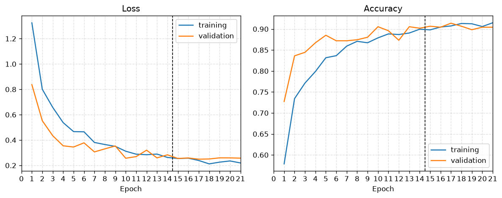
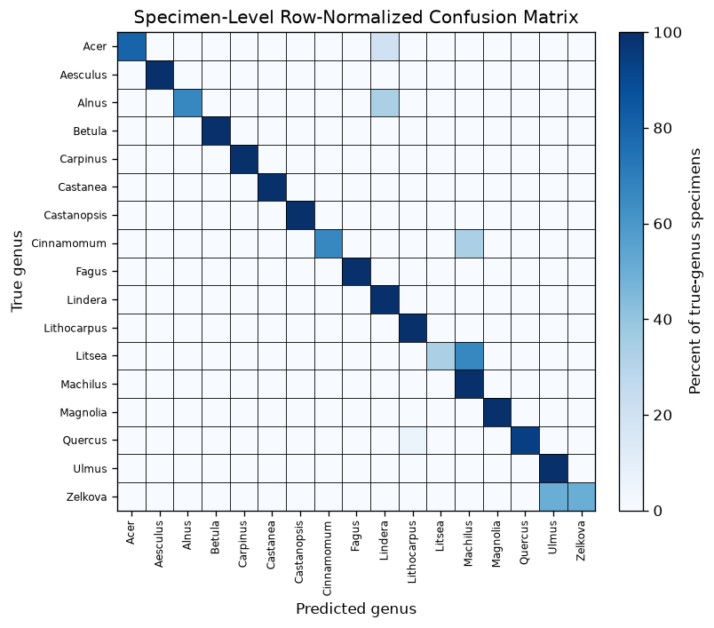
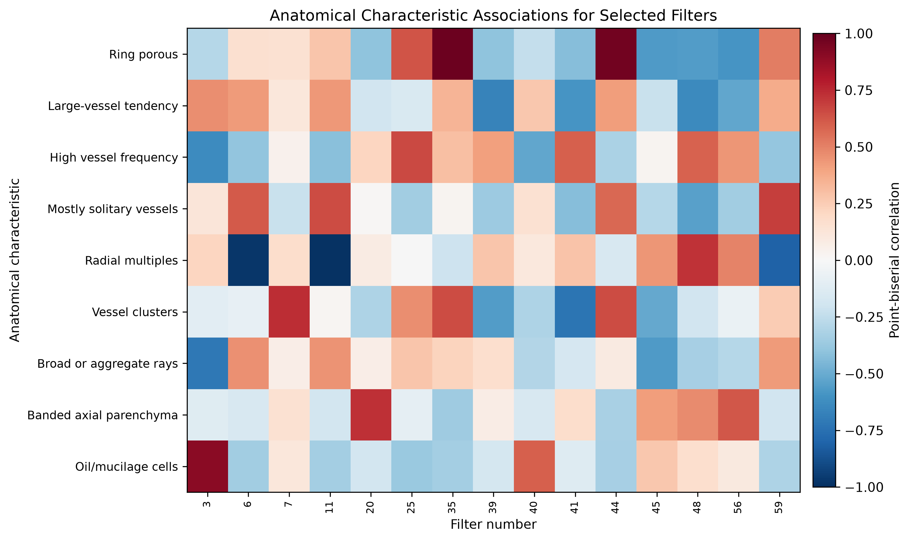
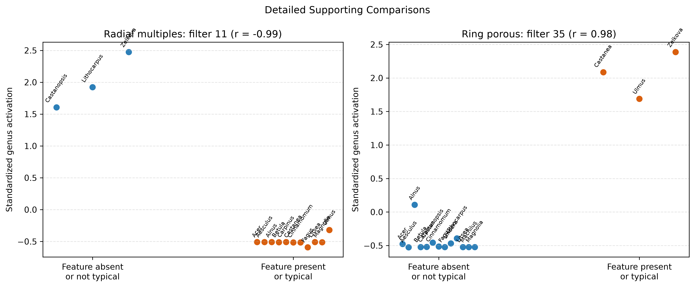

# Wood Genus Classification from Microscopic Images with CNNs and Transfer Learning

> **Martin Mayer**  
> **CSCI E-89**  
> **Professor: Dmitry Kurochkin, PhD**  
> **Teaching Assistants: Andrey Sivachenko, Andrea Hatch, Kurt Rayner, and Sathvika Iyengar**
>
> 
> **[GitHub Repository](https://github.com/mayerkrebs/Harvard-CSCI-89-Deep-Learning)**  
> **[Raw Dataset](https://repository.kulib.kyoto-u.ac.jp/items/7f0f28bd-f9b0-4603-be8e-7c7d908a245f)**  
> **[Project Dataset](https://drive.google.com/file/d/1QmX8vWyJzU3U1tOJvRGy-d3xL3XbvAZf/view?usp=sharing)**  

---

## Abstract

This project develops a convolutional neural network for classifying microscopic wood images into 17 genera using transfer learning. The source data come from the Xylarium Digital Database for Wood Information Science and Education (XDD_015), published by the Research Institute for Sustainable Humanosphere at Kyoto University. The selected collection contains 33 genera, 119 species, 540 specimens, and 7,051 optical micrographs at 600 × 600 resolution. Genera with fewer than 12 independent specimens were excluded so that every retained class could be represented in training, validation, and test subsets. The resulting modeling dataset contains 466 specimens and 5,992 images.

The original archive was processed once into grayscale PNG files and an accompanying manifest. Data were split by physical specimen rather than by image, ensuring that images from the same specimen could not appear in more than one subset. This design reduces leakage and makes specimen-level performance the primary measure of generalization.

The model uses an ImageNet-pretrained EfficientNetV2B0 backbone and a task-specific classification head. Training was performed in two stages: first with the backbone frozen, followed by limited fine-tuning at a lower learning rate. The final model achieved a specimen-level test accuracy of 0.884 and macro F1 of 0.864 on 69 previously unseen specimens. Image-level accuracy and macro F1 were 0.873 and 0.839 on 893 test images.

The project also explores learned feature activations. Filter responses were aggregated first by specimen and then by genus and compared with genus-level anatomical characteristics. Several strong descriptive associations emerged. They remain exploratory because the analysis includes only 17 genera.

Overall, the project demonstrates a practical, leakage-aware workflow for multiclass wood-genus classification and the application of transfer learning to a specialized biological image domain.

## 1. Problem and Project Scope

This project develops a convolutional neural network that classifies microscopic wood images into 17 genera. It is a practical demonstration of a complete deep-learning workflow in Keras: constructing a leakage-aware dataset, adapting a pretrained image model, and preserving specimens instead of images as the primary unit of evaluation. As such, the task at hand is a multiclass wood genus prediction.

Wood taxonomy provides a natural hierarchy for defining the target. A family may contain multiple genera, and a genus may contain multiple species. Species was not selected because the source archive contains too few independent specimens for many species to support the intended training, validation, and test workflow. Family, at the other extreme, was considered too broad for the project objective. Genus therefore provides a pragmatic intermediate target: it retains meaningful taxonomic detail while supporting a multiclass dataset with repeated independent specimens in every retained class.

The modeling dataset contains the following genera: Acer, Aesculus, Alnus, Betula, Carpinus, Castanea, Castanopsis, Cinnamomum, Fagus, Lindera, Lithocarpus, Litsea, Machilus, Magnolia, Quercus, Ulmus, and Zelkova. Each genus may include multiple species and biological variation among specimens.

A specimen represents one specific tree and includes a stack of related microscopic images. Those images are not independent samples. The network predicts individual images, but specimen-level performance is primary. Specimen identity therefore governs data splitting, class weighting, and evaluation.

Beyond predictive performance, the project examines activations from the final convolutional feature layer. These activations are aggregated first by specimen and then by genus and compared with genus-level anatomical characteristics, like ring porosity and vessel grouping for example. The purpose is not to claim that individual filters uniquely detect specific biological structures, but to investigate whether the learned representation contains patterns that align with known wood anatomy. The anatomical characteristics follow the IAWA microscopic hardwood feature framework and are encoded as genus-level labels.

## 2. Dataset and Wood Anatomy

### 2.1 WIG Dataset and Retained Taxa

The source data come from the Xylarium Digital Database for Wood Information Science and Education (XDD), published by the Research Institute for Sustainable Humanosphere at Kyoto University (Sugiyama et al., 2020). This project uses XDD_015, the 600-pixel hardwood optical-micrograph collection distributed as WIG_v1.2.1_600.h5. The archive is approximately 2.08 GB and contains images covering an actual wood area of approximately 2.7 × 2.7 mm, with a reported resolution of 4.44 μm per pixel.

The file uses an HDF5 hierarchy of family/genus/species/specimen, with each terminal specimen stored as a variable-length stack of 600 × 600 single-channel uint8 images. The archive contains 7 families, 33 genera, 119 species, 540 specimens, and 7,051 images.

The HDF5 archive was processed once during data preparation. Eligible genera were selected, and their images were exported as grayscale PNG files while preserving the original 600 × 600 pixel values. The subsequent modeling workflow operates on the exported files under wood_data/train, wood_data/validation, and wood_data/test, rather than reading the HDF5 archive directly. The accompanying wood_data/manifest.csv records each image’s genus, specimen identity, split assignment, image index, and original HDF5 path.

After filtering, the modeling dataset contains 17 genera, 466 specimens, and 5,992 images. Table 1 compares the complete XDD_015 archive with the retained dataset and its realized train, validation, and test splits. The split counts were recalculated from manifest.csv, and no specimen identifier appears in more than one subset.

| Dataset stage | Genera | Specimens | Images |
|---|---:|---:|---:|
| Raw WIG archive | 33 | 540 | 7,051 |
| Retained modeling dataset | 17 | 466 | 5,992 |
| Training split | 17 | 328 | 4,263 |
| Validation split | 17 | 69 | 836 |
| Test split | 17 | 69 | 893 |

Table 1. Dataset accounting from the source archive and exported manifest.

### 2.2 Wood Anatomy Relevant to the Task

The images show transverse wood structure, where anatomical organization across the stem can provide taxonomic information. The relevant evidence is not a single object or boundary. It is a combination of vessel distribution, vessel grouping, growth-ring organization, rays, axial parenchyma, and specialized cellular features. These structures can differ among genera, but they can also vary among species and specimens within a genus.

Growth rings are boundaries associated with successive periods of wood formation. Their visibility depends on changes in the size, frequency, or arrangement of cells across a ring. Ring-porous wood has a concentration of comparatively large vessels in earlywood near the beginning of a growth ring, followed by smaller vessels in laterwood. Vessel size and vessel frequency describe related but distinct aspects of the conducting tissue: the dimensions of vessel openings and how densely those openings occur.

Vessel grouping provides another set of transverse patterns. Mostly solitary vessels occur separately from neighboring vessels. Radial multiples are groups aligned in the radial direction, while vessel clusters form less strictly linear groups. These arrangements matter because two genera can have broadly similar vessel sizes but differ in how vessels are distributed and grouped.

Rays are bands of radially oriented tissue. Broad rays or aggregate rays can produce conspicuous radial structures in transverse images. Axial parenchyma is oriented primarily along the stem axis; in transverse view, its distribution around vessels or in bands can create genus-relevant patterns. Oil or mucilage cells are specialized cells containing secretory material. Tyloses are outgrowths that can partially or fully occlude vessel lumina. Together, these features describe multiple spatial scales, from individual vessel contents to tissue-level arrangements across a growth ring.

Table 2 summarizes the 11 anatomical characteristics used in the feature-interpretation analysis. The nomenclature follows the *IAWA List of Microscopic Features for Hardwood Identification* (Wheeler et al., 1989). These values provide contextual evidence about genera rather than image-level annotations; a genus-level value does not imply that a feature is visible in every image or invariant within a genus.

| Genus | F1 | F2 | F3 | F4 | F5 | F6 | F7 | F8 | F9 | F10 | F11 |
|---|---:|---:|---:|---:|---:|---:|---:|---:|---:|---:|---:|
| Acer | 1 | 0 | 0 | 0.5 | 0 | 1 | 0.5 | 1 | 1 | 0 | 0 |
| Aesculus | 1 | 0 | 0 | 1 | 0 | 1 | 0 | 0 | 1 | 0 | 1 |
| Alnus | 1 | 0 | 0 | 1 | 0 | 1 | 0 | 1 | 0 | 0 | — |
| Betula | 1 | 0 | 0 | 1 | 0 | 1 | 0 | 0 | 1 | 0 | — |
| Carpinus | 1 | 0 | 0 | 0.5 | 0 | 1 | 0 | 1 | 0 | 0 | 1 |
| Castanea | 1 | 1 | 1 | — | 0.5 | 1 | 1 | 0 | 0 | 0 | 1 |
| Castanopsis | 0.5 | 0 | 1 | 0 | 1 | 0 | 0 | 0.5 | 0.5 | 0 | 1 |
| Cinnamomum | 0.5 | 0 | 1 | 0 | 0 | 1 | 0 | 0 | 0 | 1 | 1 |
| Fagus | 1 | 0 | 0 | 1 | 0 | 1 | 1 | 1 | 0 | 0 | 0.5 |
| Lindera | — | 0 | — | 0 | 1 | 0.5 | 0.5 | 0 | 0 | 1 | — |
| Lithocarpus | 0.5 | 0 | 1 | 0 | 1 | 0 | 0 | 1 | 0.5 | 0 | 1 |
| Litsea | 1 | 0 | 1 | 0 | 0.5 | 1 | 0 | 0 | 0 | 1 | 0.5 |
| Machilus | 1 | 0 | 1 | — | 1 | 0.5 | 0.5 | 0 | 0 | 1 | — |
| Magnolia | 1 | 0 | 1 | 0 | 0 | 1 | 1 | 0 | 1 | 1 | 1 |
| Quercus | 0.5 | 0.5 | 1 | — | 1 | 0.5 | 0.5 | 1 | — | 0 | 1 |
| Ulmus | 1 | 1 | 1 | — | 0.5 | 1 | 1 | 1 | 0 | 0 | 1 |
| Zelkova | 1 | 1 | 1 | — | 0.5 | 0 | 1 | 1 | 0 | 0 | — |

Table 2. Genus-level anatomical characteristics used for feature interpretation.

F1 = distinct growth rings; F2 = ring porous; F3 = large-vessel tendency; F4 = high vessel frequency; F5 = mostly solitary vessels; F6 = radial multiples; F7 = vessel clusters; F8 = broad or aggregate rays; F9 = banded axial parenchyma; F10 = oil or mucilage cells; F11 = tyloses.

Values of 1 and 0 indicate presence and absence, respectively. A value of 0.5 indicates either intermediate feature expression or ambiguity among species within the genus. Values of 0.5 and missing values were excluded from binary feature-association tests.

## 3. Data Preparation and Leakage Prevention

### 3.1 Target Filtering

Only genera with at least 12 independent specimens were retained. This ensures that each retained genus has enough specimens to contribute to training, validation, and test subsets under the planned per-genus allocation. The threshold excludes 16 of the 33 genera in the original dataset and produces the 17-class dataset described above and used throughout the project.

### 3.2 Specimen-Level Splitting

Splits were assigned within each genus with intended proportions of 70% training, 15% validation, and 15% test. For each genus, specimen paths were shuffled and rounded counts were assigned to the three subsets, with at least one specimen reserved for validation and one for test. Per-genus rounding yields aggregate counts of 328 training, 69 validation, and 69 test specimens rather than exact 70/15/15 proportions across all 466 specimens.

All images belonging to a specimen inherit that specimen's split. This prevents an image from one physical sample from appearing in training while another image from the same sample appears in validation or test. Such image-level mixing would allow the model to exploit specimen-specific appearance and would overstate its ability to generalize to unseen wood specimens.

### 3.3 Model Preprocessing and Training Augmentation

During model loading, each PNG is converted to grayscale and resized from 600 x 600 to 384 x 384 pixels using bilinear resampling. The single grayscale channel is repeated three times to match the pretrained network's expected input shape. Pixel values are then scaled to the interval [-1, 1]. EfficientNetV2's built-in preprocessing is disabled so that scaling is applied exactly once.

Augmentation is applied only to training images. Each training image may be flipped horizontally and vertically, rotated by 0, 90, 180, or 270 degrees, translated by up to 5% of its width and height, and adjusted with brightness and contrast factors sampled from 0.9 to 1.1. Validation and test images are resized and scaled but are not augmented. This preserves stable validation and test sets while allowing the training loader to present modest orientation and acquisition variation.

### 3.4 Class Imbalance

The retained genera contain unequal numbers of specimens and images. Class weights are therefore calculated from unique training specimens rather than image counts. For genus $g$, the weight is

$$
w_g = \frac{N}{K n_g},
$$

where $N$ is the total number of training specimens, $K=17$ is the number of genera, and $n_g$ is the number of training specimens in genus $g$. The resulting genus weight is attached to each training image as a sample weight. This choice aligns weighting with the independent biological unit, although specimens still contribute different numbers of images.

## 4. Reproducibility and Computing Environment

### 4.1 Software Setup

The project was run with Python 3.12.13. The direct Python dependencies and the versions used for the final workflow are vailable in "requirements.txt".

The requirements file installs Keras 3.15.0 with PyTorch 2.13.0 as its backend, together with the data-processing, visualization, and evaluation libraries used by the notebooks. The pinned PyTorch package is the CUDA 13.0 build used for NVIDIA GPU acceleration during training.

To reproduce the workflow, run "1. data_pipeline.ipynb", "2. train_model.ipynb", and "3. feature_interpretation.ipynb" in order. The source archive is expected at "hd5_dataset/WIG_v1.2.1_600.h5". The first notebook creates the exported PNG dataset and manifest, the second trains and evaluates the model, and the third analyzes the final model's learned features.

### 4.2 Training Hardware

The model was trained locally on a Lenovo Legion 5 15ACH6 running Microsoft Windows 11. The computer has an AMD Ryzen 7 5800H processor with 8 cores and 16 logical processors, 16 GB of installed RAM, and an NVIDIA GeForce RTX 3050 Ti Laptop GPU. Mixed-precision training and the CUDA-enabled PyTorch backend were used to reduce GPU memory use and accelerate computation.

## 5. Model and Training Strategy

### 5.1 Architecture

The model uses EfficientNetV2B0 (Tan & Le, 2021) pretrained on ImageNet (Deng et al., 2009) as a convolutional backbone. The classification top is removed, the backbone receives 384 x 384 three-channel inputs, and its built-in preprocessing is disabled. A small task-specific head adds a 64-filter 3 x 3 convolution with a swish activation, global average pooling, dropout set at 0.3 to avoid overfitting, and a 17-unit softmax output (one for each genus). The added convolution is named "wood_features", and its 12 x 12 x 64 output retains a compact spatial representation before pooling.

This architecture is intentionally limited. The pretrained backbone supplies general visual features, while the added convolution and classifier adapt those features to transverse wood structure. 

### 5.2 Two-Stage Transfer Learning

Training follows a pragmatic two-stage transfer-learning workflow. In the first stage, all EfficientNetV2B0 backbone layers are frozen and only the wood-specific head is trained. This allows the randomly initialized head to adapt to the 17 classes before pretrained features are modified. The stage uses AdamW with a learning rate of $10^{-3}$, sparse categorical cross-entropy, a maximum of 25 epochs, and a batch size of 32.

In the second stage, the final 20 non-batch-normalization layers of the backbone are made trainable. Batch-normalization layers remain frozen, and the model is recompiled with AdamW at the smaller learning rate of $10^{-5}$. Fine-tuning is limited to a maximum of 10 epochs.

Both stages monitor validation loss with early-stopping patience of four epochs and restore the weights from the best observed validation loss. Mixed-precision computation is enabled through Keras, which runs with the PyTorch backend. The frozen-stage model and final fine-tuned model are saved separately as "wood_genus_frozen_backbone.keras" and "wood_genus_finetuned.keras". Table 3 summarizes the model and training configuration.

| Component | Configuration |
|---|---|
| Input | 384 x 384 grayscale repeated over 3 channels; values scaled to [-1, 1] |
| Backbone | ImageNet-pretrained EfficientNetV2B0 (classification top removed) |
| Task-specific head | 64-filter 3 x 3 swish convolution; global average pooling; dropout 0.3; 17-way softmax |
| Optimizer and loss | AdamW; sparse categorical cross-entropy |
| Frozen phase | Backbone frozen; learning rate $10^{-3}$; maximum 25 epochs |
| Fine-tuning phase | Final 20 non-batch-normalization backbone layers trainable; learning rate $10^{-5}$; maximum 10 epochs |
| Batch size | 32 |
| Stopping rule | Validation loss; patience 4; restore best weights |

Table 3. Model and training configuration.

## 6. Evaluation Design

The final fine-tuned model is evaluated on the locked test split of 893 images from 69 specimens. As mentioned earlier, test images receive the same resizing, channel repetition, and scaling used for validation images, without training augmentation.

Evaluation is reported at both image and specimen levels. At image level, the class with the highest softmax probability is selected for each image. At specimen level, the softmax probability vectors for all images from the same specimen are averaged. The genus with the highest mean probability is then assigned as that specimen's prediction. This aggregation gives each specimen one final prediction regardless of how many images it contains.

Specimen-level accuracy and macro F1 are the primary outcomes because specimens are the independent units in the split. Image-level accuracy and macro F1 are secondary measures of individual-image behavior. Macro F1 calculates F1 separately for each of the 17 genera and averages those values equally, preventing genera with more test examples from dominating the summary.

## 7. Classification Results

### 7.1 Training Outcome

Frozen-backbone training ran for 14 epochs before early stopping, with a best validation accuracy of 0.906. Limited fine-tuning ran for 7 epochs and reached a best validation accuracy of 0.914. Fine-tuning improved validation accuracy by only 0.8 percentage points. Figure 1 shows the saved training and validation histories across both phases.

*Figure 1. Training and validation loss and accuracy across the frozen-backbone and fine-tuning phases; the dashed line marks the phase boundary.*

### 7.2 Test Metrics

The final model's primary specimen-level accuracy is 0.884 and its specimen-level macro F1 is 0.864. Specimen-level top-2 accuracy is 0.957 and is reported as a secondary shortlist metric: it measures whether the correct genus appears among the model's two highest-probability predictions after probabilities are averaged by specimen. The secondary image-level accuracy is 0.873, top-2 accuracy is 0.944, and macro F1 is 0.839. Table 4 reports the metrics with the corresponding test support.

| Evaluation unit | Test support | Accuracy | Top-2 accuracy | Macro F1 |
|---|---:|---:|---:|---:|
| Specimen | 69 specimens | 0.884 | 0.957 | 0.864 |
| Image | 893 images | 0.873 | 0.944 | 0.839 |

Table 4. Final fine-tuned model performance on the locked test split.

Figure 2 presents the row-normalized specimen-level confusion matrix. Each row represents the distribution of predictions for one true genus, expressed as a percentage of that genus's test specimens. 

*Figure 2. Row-normalized confusion matrix for the 69 locked test specimens.*

The specimen-level confusion matrix shows that errors were concentrated in a small number of genera, while 11 of the 17 genera were classified correctly for every test specimen. The most substantial difficulty occurred for Litsea, whose specimens were frequently classified as Machilus. Other confusions included Cinnamomum with Machilus, Quercus with Lithocarpus, and Zelkova with Ulmus. These pairs belong to the same botanical families and may share visually similar wood-anatomical characteristics. Because several genera have only a few test specimens, however, the row percentages are sensitive to individual errors and should be interpreted cautiously.

## 8. Exploratory Feature Interpretation

### 8.1 Method

Feature interpretation uses the final fine-tuned model, "wood_genus_finetuned.keras", and only images from the test split. It examines the 64 activation maps from the model's "wood_features" layer. Each 12 x 12 map is average pooled to obtain one activation per filter and image. Activations are then averaged first across images within each specimen and then across specimens within each genus. This gives every specimen equal weight in the final 17-genus by 64-filter matrix. Each filter is standardized across genera before comparison.

For each anatomical characteristic in Table 2, the analysis compared genera coded as absent or not typical with genera coded as present or typical. Only genera coded exactly 0 or exactly 1 were included: 0 means absent or not typical of the genus, and 1 means present or typical of the genus. Values of 0.5 and missing labels were excluded. A characteristic was retained only when both groups contained at least three genera. Point-biserial correlations summarize each eligible comparison, and associations are ranked by absolute correlation.

### 8.2 Anatomical Characteristic Associations

Figure 3 summarizes which learned filters are associated with each eligible wood-anatomical characteristic. Positive values indicate higher activation among genera where the feature is present or typical, while negative values indicate higher activation among genera where the feature is absent or not typical. The displayed filters are the union of the two filters with the largest absolute correlation for each eligible characteristic; all valid characteristic-filter combinations are retained in the full notebook heatmap. Distinct growth rings and tyloses are excluded because at least one comparison group contains fewer than three genera.

*Figure 3. Each cell is a descriptive point-biserial correlation between a genus-level anatomical characteristic and standardized genus-level activation for a selected `wood_features` filter, computed only from genera coded exactly 0 or 1. Red indicates higher activation where the feature is present or typical, blue indicates higher activation where it is absent or not typical, and gray, if present, marks an invalid masked combination.*

Table 5 reports the strongest valid filter association for each of the nine estimable characteristics. The largest absolute correlations occur for radial multiples with filter 11 ($r=-0.986$), ring porosity with filter 35 ($r=0.981$), and oil or mucilage cells with filter 3 ($r=0.899$). The remaining strongest correlations range in absolute magnitude from 0.664 to 0.736. Their directions vary: large-vessel tendency and broad or aggregate rays are associated with lower activation in their selected filters, whereas high vessel frequency, mostly solitary vessels, vessel clusters, banded axial parenchyma, and oil or mucilage cells are associated with higher activation.

| Characteristic | Filter | Absent (n) | Present (n) | Avg. activation (Absent) | Avg. activation (Present) | Activation Difference | Correlation |
|---|---:|---:|---:|---:|---:|---:|---:|
| Radial multiples | 11 | 3 | 11 | 2.002 | -0.501 | -2.502 | -0.986 |
| Ring porous | 35 | 13 | 3 | -0.451 | 2.054 | 2.505 | 0.981 |
| Oil or mucilage cells | 3 | 12 | 5 | -0.563 | 1.351 | 1.914 | 0.899 |
| Vessel clusters | 7 | 8 | 5 | -0.539 | 1.107 | 1.647 | 0.736 |
| Banded axial parenchyma | 20 | 10 | 4 | -0.553 | 0.789 | 1.342 | 0.731 |
| Broad or aggregate rays | 3 | 8 | 8 | 0.711 | -0.724 | -1.435 | -0.718 |
| Mostly solitary vessels | 59 | 8 | 5 | -0.465 | 0.215 | 0.680 | 0.689 |
| Large-vessel tendency | 39 | 6 | 10 | 0.817 | -0.550 | -1.367 | -0.670 |
| High vessel frequency | 25 | 6 | 4 | -0.585 | 0.444 | 1.029 | 0.664 |

Table 5. Strongest valid descriptive filter association for each estimable anatomical characteristic.

Some filters recur across characteristics. Filter 3 appears among the two strongest associations for broad or aggregate rays, high vessel frequency, and oil or mucilage cells, with different directions. Filter 11 appears among the two strongest associations for mostly solitary vessels and radial multiples.

Figure 4 retains radial multiples and ring porosity as examples of how the matrix correlations arise from genus-level group comparisons.

*Figure 4. Supporting comparisons of standardized activation between genera where each feature is absent or not typical and genera where it is present or typical, for radial multiples with filter 11 and ring porosity with filter 35.*

These associations are exploratory. The labels apply at genus level, some comparison groups are small, and many filter-characteristic pairs were examined without multiple-comparison correction. The results therefore do not show that any filter directly detects a specific anatomical structure.

## 9. Lessons Learned

The most important methodological decision was to treat the specimen, rather than the image, as the independent unit. The pretrained EfficientNetV2B0 backbone worked well, while fine-tuning added only a modest improvement. The main classification failures were concentrated in a few pairs, particularly *Litsea–Machilus*, *Cinnamomum–Machilus*, *Quercus–Lithocarpus*, and *Zelkova–Ulmus*. Feature interpretation was useful for identifying associations with wood anatomy, but not for proving that individual filters directly detect specific structures.

## References

Deng, J., Dong, W., Socher, R., Li, L.-J., Li, K., &amp; Li, F.-F. (2009). ImageNet: A large-scale hierarchical image database. In <em>2009 IEEE Conference on Computer Vision and Pattern Recognition</em> (pp. 248–255). IEEE. <a href="https://doi.org/10.1109/CVPR.2009.5206848">https://doi.org/10.1109/CVPR.2009.5206848</a>

Sugiyama, J., Hwang, S. W., Zhai, S., Kobayashi, K., Kanai, I., &amp; Kanai, K. (2020). <em>Xylarium Digital Database for Wood Information Science and Education (XDD_015)</em> [Data set]. Research Institute for Sustainable Humanosphere, Kyoto University. <a href="https://doi.org/10.14989/XDD_015">https://doi.org/10.14989/XDD_015</a>

Tan, M., &amp; Le, Q. V. (2021). EfficientNetV2: Smaller models and faster training. In M. Meila &amp; T. Zhang (Eds.), <em>Proceedings of the 38th International Conference on Machine Learning</em> (Vol. 139, pp. 10096–10106). PMLR. <a href="https://proceedings.mlr.press/v139/tan21a.html">https://proceedings.mlr.press/v139/tan21a.html</a>

Wheeler, E. A., Baas, P., &amp; Gasson, P. E. (Eds.). (1989). IAWA list of microscopic features for hardwood identification. <em>IAWA Bulletin n.s., 10</em>(3), 219–332.

